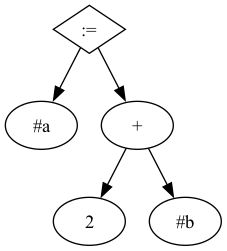
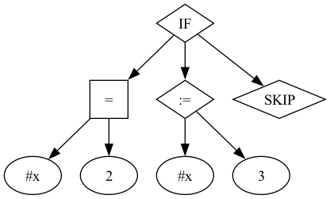
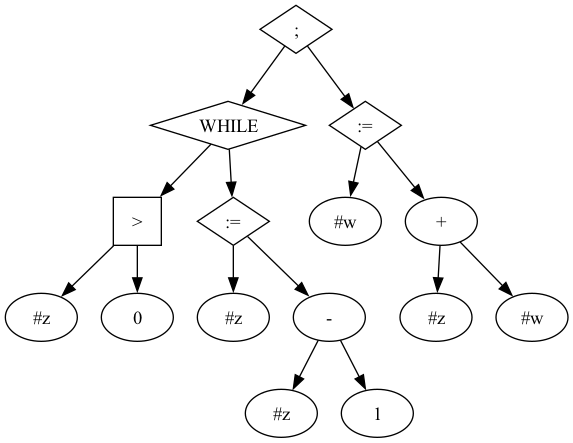
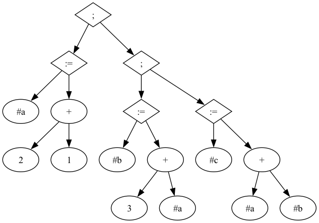
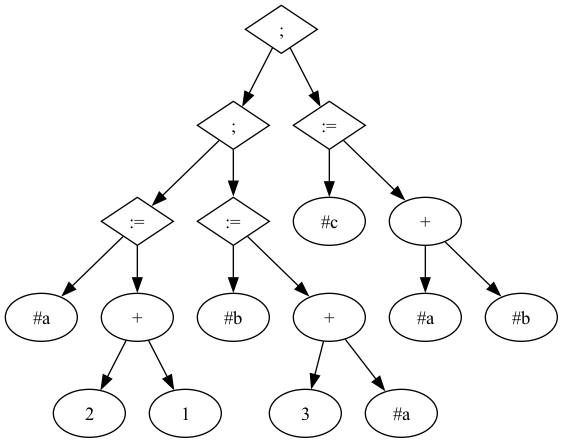

---
jupytext:
  text_representation:
    extension: .md
    format_name: myst
    format_version: 0.12
    jupytext_version: 1.8.0
kernelspec:
  display_name: OCaml 4.11
  language: OCaml
  name: ocaml-jupyter
---

# Praksa programskih jezikov (vaje)

<!-- 
Študenti naj na tablo še enkrat napišejo abstraktno sintakso jezika in s tem na kratko ponovijo jezik.
Pomembno je znova omenit, da sta l in n metaspremenljivki, ki sta implicitno kvantificirani prek vseh nizov in vseh možnih celih števil.

Pri abstraktni sintaksi ne izgubljamo časa s precedencami, čeprav je ta v resnici lahko pomembna.
Ker gre za poskusne programske jezike raje večkrat uporabimo oklepaje.
V resničnem življenju pa se poskušamo čim pogosteje izogniti dvoumnostim v jeziku, saj ljudem, ki pišejo programe, ni všeč, če morajo pisati oklepaje ali če se stalno sprašujejo, kako bo prevajalnik razumel njihov program.

-->

## Naloga 1 (Sintaksa jezika)

Narišite sintaktično drevo, ki ustreza naslednjim programom:

```
#a := 2 + #b
```
```{toggle} Rešitev

```

```
if #x = 2 then 
  #x := 3
else
  skip
```
```{toggle} Rešitev

```

```
(while #z > 0 do 
  #z := #z - 1
);
#w := #z + #w
```
```{toggle} Rešitev

```

```
(while #z > 0 do #z := #z - 1);
#w := #z + #w
```
```{toggle} Rešitev

```

Pri zadnjih dveh možnosti je pomembno, da smo z oklepaji določili, ali je ukaz del zanke while ali ne.
Zaradi načina, kako je zapisan naš razčlenjevalnik je program brez oklepajev celo neveljaven.
V resničnem svetu, pa je način, kako razčlenjevalnik razume program odvisno od tega, kateri izmed možnih konstruktov ima prednost (večjo precedenco).
Najpogosteje programski jeziki vzamejo, da ima `;` večjo precedenco od ostalih ukazov.
V tem primeru bi bil program brez okepajev enak zadnjemu primeru.

V programskih jezikih, ki za določanje dosega spremenljivk uporabljajo zavite oklepaje (npr. C in Java), tako zanke kot telo vzamejo en sam ukaz, ampak 
zaviti oklepaji celotno telo združijo v en sam atomičen ukaz - kot smo to naredili v našem razčlenjevalniku z delitvijo na `cmd` in `atomic_cmd`.

Pomemben del preučevanja programskih jezikov je **statična analiza**, kjer lahko lastnosti programa preverimo brez dejanskega izvajanja programa.
V našem primeru za risanje dreves nismo potrebovali nobenih informacij o vrednosti posameznih spremenljivk (niti tega, ali so sploh definirane).
<!-- 
Sem sicer omenil: https://en.wikipedia.org/wiki/Rice%27s_theorem, kar je že teorija izračunljivosti, je pa gotovo treba povedati, da ima statična analiza zgolj omejeno moč (ki pa se v praksi lahko vseeno izkaže za uporabno).
To spet pride do izraza pri for zankah.
-->

Zgornje slike lahko zgenerirate tudi sami s pomočjo programa `dot` iz paketa `graphviz` in promerni zastavici podani prevajalniku.
Na primer, za zgornje programe lahko napišemo: `./imp.exe --ast vaje/while1.imp | dot -Tpng:cairo > while1.png`

## Naloga 2 (Sintaksa jezika)

Napišite sintaktično drevo, ki ustreza naslednjim programom:

```
#a := 2 + 1;
(#b := 3 + #a;
#c := #a + #b)
```
```{toggle} Rešitev

```

```
(#a := 2 + 1;
#b := 3 + #a);
#c := #a + #b
```
```{toggle} Rešitev

```

Sicer še nismo natančno definirali pomena programov, je jasno, da bi morala biti vrednost `#c` v obeh primerih enaka `9` in da je očitno da v normalnem programskem jeziku pričakujemo, da je operator `;` asociativen.


```{admonition} V razmislek
Zahteva po asociativnosti je tudi razlog, zakaj za monade (te bomo spoznali v kasnejših razdelkiih) zahtevamo, da je operacija `bind` asociativna.
V osnovi pa to izhaja iz asociativnosti komponiranja funkcij, kar bomo spoznali pri razdelku o denotacijski semantiki.
```

```
#a := 2 + 1;
#b := 3 + #a;
#c := #a + #b
```
```{toggle} Rešitev

```

Pri risanju drevesa se moramo odločiti, ali je operator `;` asociativen levo ali desno.
Praviloma je vseeno za kaj se odločimo, a po dogovoru je v programskih jezikih operator `;` asociativen desno (kot smo to naredili v našem razčlenjevalniku in kot so postavljeni oklepaji v prvem primeru).
S tem si zagotovimo kodo, ki je brez dodatnega truda lepo poravnana na levo, lahko pa s pomočjo oklepajev dosežemo tudi drugačno razčlenitev.

Pomembno je omeniti še obnašanje operatorja `;`, saj se verjetno obnaša nekoliko drugače kot smo pričakovali.
Program `skip;` je namreč v našem jeziku neveljaven, saj `;` ločuje dva ukaza - ju poveže v en sam ukaz.
V resničnem svetu pa `;` pogosteje nastopa kot zaključe ukaza, zato je `skip;` veljaven program, ki seveda ne naredi ničesar.

```{admonition} V razmislek
Ko defniramo sinkatsko ali obnašanje jezika (ali nekaj novega) je na splošno dobro da se držimo konvencij, ki so že uveljavljene v drugih jezikih.
Prav tako je dobro, da sintakso naredimo nedvoumno poskrbimo, da so robni primeri taki da se zgoi natanko ena izmed sledečih možnosti:
- Tako je očitno kaj je bilo v morebitnem dovumne izrazu mišljeno.
- Program je neveljaven in ga razčlenjevalnik zavrne.
```

```{admonition} V razmislek
Enostavnost razčlenjevanja pogosto igra pomembno vlogo pri odločitvi, kako bomo definirali jezik.
V našem primeru smo tako lokacije definirali kot nize, ki se začnejo z znakom "#", saj je zaradi tega že po prvem znaku jasno, da gre za lokacijo in ne ključno besedo.
Večina obstoječih jezikov na podoben način dovoljuje uporabo številk v imenih spremenljivk v kolikor se le-ta začnejo z črko.
S tem si zagotovimo, da je razčlenjevanje bolj enostavno, saj je dovolj, da pogledamo prvi znak in se odločimo, ali gre za spremenljivko/ključno beseso, ali za kak čuden IEEE zapis števila.
```

## Naloga 3 (Primejava jezikov)

### Napišite program, ki sešteje vsa naravna števila manjša od `n`.

```
#n := 10;
#sum := 0;
(while #n > 0 do (
    #sum := #sum + #n;
    #n := #n - 1
));
print #sum
```

### Napišite program, ki preveri ali je podano število praštevilo.

Program `primes.imp` iz predavanj.

## Naloga 4 (Razširitev jezika)

### V jezik IMP dodajte logična veznika `&&` in `||`.

Za potrebe raziskovanja jezike pogosto razširimo z novimi konstrukti.
Običajno pri tem ne navedemo celotne sintakse, ampak zgolj tiste dele, ki so se spremenili.
Pogosto namesto natančne logične sintakse uporabimo poenostavljeno obliko BNF notacije, ki sicer ni povsem natančna, ampak je lažje berljiva.

Veznika `&&` in `||` sta binarna operatorja, ki iz dveh logičnih izrazov konstruirata nov logični izraz.

    <bexp> ::= ...
            |  <bexp> "&&" <bexp>
            |  <bexp> "||" <bexp>

Jezik smo s tem močno spremenili, saj sedaj iz logičnih vrednosti lahko dobimo nove logične vrednosti, saj prej le-te niso bile definirane rekurzivno.
Prav tako se lahko pojavi tudi težava pri razčlenjevanju izraza `3 < 4 && "false"`, ki je ob napačno postavljenih oklepajih neveljaven.

Odločitev, katere uporabimo kot veznik je popolnoma naša, je pa lepo, da smo pri tem uvidevni do uporabnikov našega jezika.
To predvsem pomeni, da uporabimo že znane simbole in da se obnašamo konsistentno.
Nesmiselno bi bilo namreč, da bi uporabili veznika `&&` in `"OR"`.

```{admonition} V razmislek
Glede na to, da moramo za naš jezik napisati tudi razčlenjevalnik pri odločitvi ne nepomembno, katera izmed možnosti bo lažja za razčlenjevanje.
Pri resnem jeziku sicer več pozornosti namenimo enostavnosti uporabe in smo v to pripravljeni vložiti veliko truda.
Je pa res, da to navadno ni naša prva skrb, ampak jo odpravimo [po potrebi](https://docs.python.org/3.10/whatsnew/3.10.html#syntaxerrors).
```

### V jezik IMP dodajte ukaz `switch`, ki zamenja vrednosti dveh lokacij.

Pri sintaksi ukaza imam spet precej proste roke in se lahko odločimo za simbol, ključno besedo ali kaj tretjega.
Spet imamo v mislih dejstvo da bo za to potrebno napisati razčlenjevalnik, zato se odločimo za nekaj kar bo enostavno razčleniti.

    <cmd> ::= ...
            | SWITCH <location> <location>

Pri dodajanju ukaza `SWITCH` je pomembno, da sta oba podizraza tipa `location`, saj bi menjavanje vrednosti dveh poljubnih izrazov lahko povzročilo težave.
Le kaj naj recimo naredi `SWITCH (#a + 10) (#b + #c - #d)`?

```{admonition} V razmislek
Poznavalci jezika C++ bi znali pripomniti da bi s pomočjo referenc lahko napisali kaj podobnega, vendar nam specifikacija tega ne dovoljuje.
```

### V jezik IMP dodajte ukaz `fail`, ki prekine izvajanje programa.

Ukaz `FAIL` dodamo enostavno.
Iz ljubega miru bi se verjetno lahko vprašali, ali bi bilo smiselno ukazi dodati še aritmetični izraz, ki bi podal razlog zakaj je prišlo do napake.
To prepuščamo bralcu v vajo.

    <cmd> ::= ...
            | FAIL


Posodobljena koda prevajalnika s komentarji je dostopna na [GitHubu](TODO).

Poglejmo si samo nekaj odločitev, ki smo jih sprejeli.
Čeprav izvajanje ni definirano, v interpreterju za logične izraze najprej izračunamo oba podizraza in šele potem izvedemo operacijo.
Večina programskih jezikov uporablja tako imenovano **kratkostično** (ang. *short-circuit*) izvajanje, kjer se drugi podizraz izračuna le, če je to potrebno.

Izvajanje in razčlenjevanje ukaza `SWITCH` je precej preprosto, saj je potrebno zgolj zamenjati vrednosti dveh lokacij.
Treba pa je biti pozoren na primer, ko med seboj zamenjamo isto lokacijo.
Možnosti je več:
1. Vrednost lokacije se ne spremeni - pomen je enak kot pomen ukaza `SKIP`.
1. Program javi napako.
1. Razčlenjevalnik (prevajalnik) javi napako in program zavrne.

Prva možnost je enostavna in deluje ok, potrebno je biti le malo bolj pazljiv pri implementaciji, da si sličajno česa ne prepišemo.
Druga možnost je bolj enostavna za implementacija, a nerodna s strani uporabe, saj mora uporabnik to preveriti sam.
Je pa lahko zato bolj učinkovita, saj se lahko v nekaterih primerih izognemo izvajanju programa (ko recimo programer ve, da lokaciji ne bosta enaki, prevajalnik pa ne).
Zadnja možnost je sicer v našem jeziku enostavno preveriti, v plošnem pa ni [trivialna](https://en.wikipedia.org/wiki/Aliasing_(computing)).

Pri implementaciji ukaza `FAIL` smo se odločili, da bomo izvajanje programa prekinili z izjemo, ki jo `OCaml` že podpira.
V kolikor naš programski jezik ne bi podpiral izjem, bi lahko spremenili tip rezultata funkcije `eval_cmd` v `'state result`, kjer je `type 'a result = Ok of 'a | Fail 'a`.
S tem bi lahko v primeru napake vrnili `Fail`, ki pa bi ga morali obdelati v vsakem izvajanju ukaza.

<!--  
A je mogoče smiselno naredit eno tako implementacijo?
Na vajah sem omenil bootstrapping jezikov, kjer jezik napišemo v samem sebi in s tem lepo implementiramo najprej monadično izvajanje, nato pa še izjeme, ko jih začnemo podpirat.
-->

## Naloga 4 (Razširitev jezika)
Izboljšajte razlenjevalnik, da bo dopolnil nepopolne `if` stavke. Ukaz `if b then c` naj se prevede v enako sintaktično drevo kot `if b then c else skip`.

Dodajanje te funkcionalnosti je precej preprosto, saj moramo le spremeniti razčlenjevalnik.
Je pa to pomembno s stališča uporabnika, saj take stvari naredijo jezik mnogo bolj prijazen do uporabnika.
Alternativno lahko v jezik dodamo nov konstrukt `if b then c`, in posodobimo prevajalnik.
Ta možnost je načeloma slabša, saj je potrebno posodobiti razčlenjevalnik, prevajalnik in še kakšno pomožno funkcijo.
Poleg tega pa po nepotrebnem zapletemo jezik z dodajanjem novih konstruktov.
V prihajajočih poglavjih se bomo ukvarjali z dokazovanjem lastnosti programskih jezikov, kjer bo takšna sprememba še bolj problematična, saj bo potrebno ponovno dokazati nove izreke.

```{admonition} V razmislek
V res redkih primerih bi se lahko izkazalo, da bi tak nov konstrukt lahko na res eleganten način rešil nek (optimizacijski) problem in bi ga zato hoteli dodati v jezik.
V tem primeru bi bilo smiselno, da bi se odločili za dodajanje novega konstrukta, vendar je to res **zelo** redko.
```

## Naloga 5 (Razširitev jezika)

Dopolnite vse dele IMPa s podporo za `for` zanke oblike:
```
for #x := 0 to 100 do
  cmd
```
Pri tem sta `0` in `100` seveda zgolj zgled poljubnih aritmetičnih izrazov.

Naloga je (namenoma) precej odprta, saj ne povemo natančno kako naj bi se `for` zanka obnašala.
V programskem jeziku `C++` bi sledeča koda namreč naredila manj korakov kot sledeča koda v jeziku `Python`.

```cpp
for(int j = 0; j < 10; ++j){
    j += 2;
    std::cout << j << std::endl;
}
```
<!-- Ja vem, to bi compiler lahko optimiziral -->
```python
for j in range(10):
    j += 2
```

Izbira sintakse za `for` zanko je precej odprta in zopet si jo pripravimo tako, da je podobna obstoječim jezikom in enostavna za razčlenitev.

    <cmd> ::= ...
            | FOR <location> := <exp> TO <exp> DO <cmd>

Pri tolmači pa imamo več možnosti.
Lahko spišemo posebno vejo za tolmačenje for zanke (to je že narejeno v razširejenem jeziku), lahko pa for pretvorimo v ekvilaventno zanko `while`.
Sicer še vedno nimamo natančno definiranega pomena programov, lahko pa to preverimo intuitivno.

```
FOR loc := exp1 TO exp2 DO cmd
```
je ekvivalenten 
```
#loc1 := exp2;
#loc := exp1;
WHILE #loc <= #loc1 DO (
    cmd;
    #loc := #loc + 1
)
```
Kjer je `#loc1` nova lokacija, ki je ne uporabljamo v programu.

```{admonition} V razmislek
Kako dobimo svežo lokacijo, ki je še nismo uporabili v programu?
Lahko preverimo vse lokacije in izberemo neko, ki je še nismo uporabili in je gotovo ne bomo.

Najpogosteje pa "goljufamo" in zgeneriramo novo lokacijo, za katero smo gotovi, da je razčlenjevalnik ne bo skonstruiral.
V našem primeru lokacije predstavimo z nizi, a vsi nizi niso veljavne lokacije.
Če recimo svežo lokacijo kot "0N", kjer je N število katera po vrsti ta sveža lokacija je, potem smo lahko gotovi, da ne bo nikoli prišlo do prekrivanj.

To se pogosto uporablja tudi v resničnem svetu.
Programski jezik `Java` tako uporabi znak "$" za kombiniranje imen razredov in imen notranjih razredov, saj tega znaka ne moremo uporabiti v imenu razreda.
```

Prevod v 
```
#loc := exp1;
WHILE #loc <= #exp2 DO (
    cmd;
    #loc := #loc + 1
)
```
ni nujno pravilen (odvisno od semantike jezika), saj bi lahko v `cmd` vplivali na vrednost `#exp2`.
```
#n := 10;
FOR #j := 1 TO #n DO (
    #n := #n + 1
)
```

```{admonition} Večstopenjsko prevajanje
Zakaj je prevod zanke for v zanko while pred izvajanje smiselen?
Ker smo kljub dodajanju novega konstrukta v jezik, tolmač ohranili podoben.
Če smo pred tem že dokazali neke lastnosti našega jezika, te lastnosti še vedno veljajo, saj je zanka for le nek vmesni korak med konkretno sintakso in abstraktno sintaktičnim drevesom.

V resničnem življenju je prevajanje z več stopnjami, kjer zahetvnejše sintaktične konsktrukte pretvorimo v bolj enostavne konstrukte jedra jezika zelo pogoste.
```
